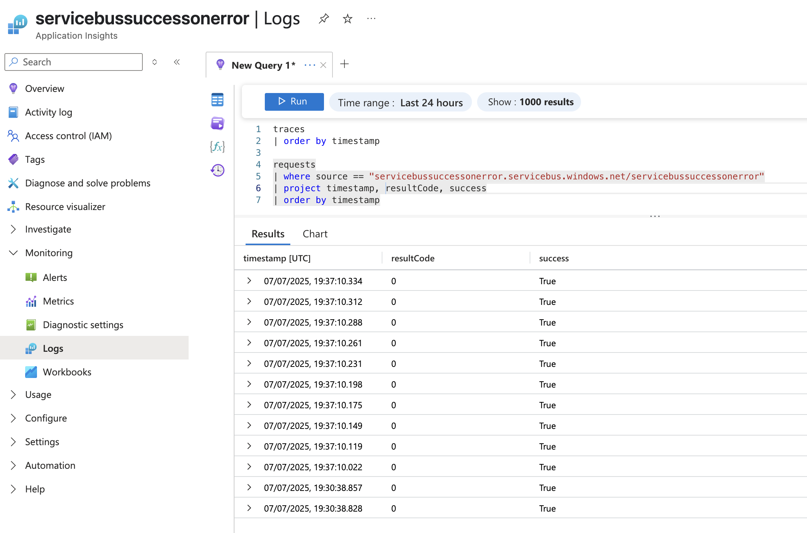
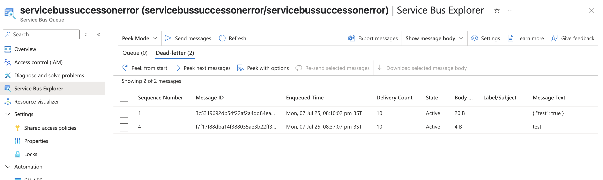

# App

This application demonstrates an issue with Azure Function Apps using Service Bus binding, where a request is marked as successful even though it fails with an error.

## Setup

Before deploying the application, you need to:

1. Create a **Service Bus** namespace.
2. Create a **Function App**.
3. Within the Service Bus, create a queue named `servicebussuccessonerror`.
4. Set the `AzureWebJobsServiceBus` environment variable with the connection string to the Service Bus.

## Reproducing the Issue

Once everything is configured, send a message to the queue. You will observe that:

- The request is marked as **successful** in the logs.
- The message is **redirected to the Dead Letter Queue** (DLQ) due to a failure in the function execution.

## Observations

### Logs

The following image shows that the request is incorrectly marked as `Success: True` despite the function returning an error:

### Dead Letter Queue

This image shows that the message is correctly redirected to the DLQ:

